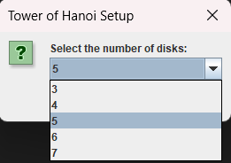
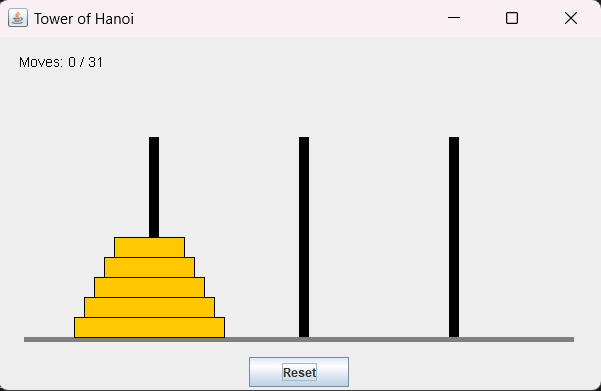
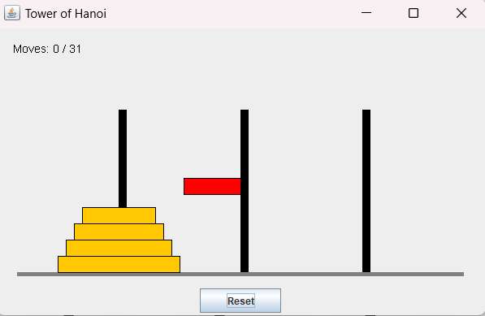
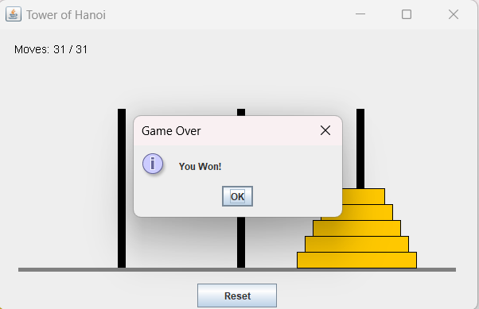

# Tower of Hanoi - Java GUI

This is a graphical user interface (GUI) implementation of the classic Tower of Hanoi problem using Java and the Swing library. The Tower of Hanoi is a mathematical puzzle where three rods and a number of disks of different sizes are given. The puzzle's goal is to move all the disks from the source rod to the destination rod, subject to the following rules:
1. Only one disk can be moved at a time.
2. Each move consists of taking the top disk from one stack and placing it on top of another stack.
3. A disk may only be placed on top of a larger disk or on an empty rod.

## Features
- Visual representation of the Tower of Hanoi problem using Java Swing.
- Interactive interface for users to choose the number of disks.

## Getting Started

### 1. Clone the repository
To clone the project repository to your local machine, run:

```bash
git clone https://github.com/Neeraj1437/Tower-Of-Hanoi.git 
```
### 2. Run the application:
Compile and run the `TowerOfHanoiGUI.java` file from the `src` directory.
  - If using the command line
    ```bash
       javac TowerOfHanoiGUI.java
       java TowerOfHanoiGUI
       ```
  - If using an IDE, simply open `TowerOfHanoiGUI.java` and run the project.

## Example Screenshots of the Application
+ **Disk Selection**:
  


+ **Main Window with Tower Setup**:
  


+ **Interactive Movement**:
  


+ **Final Solution**



  
